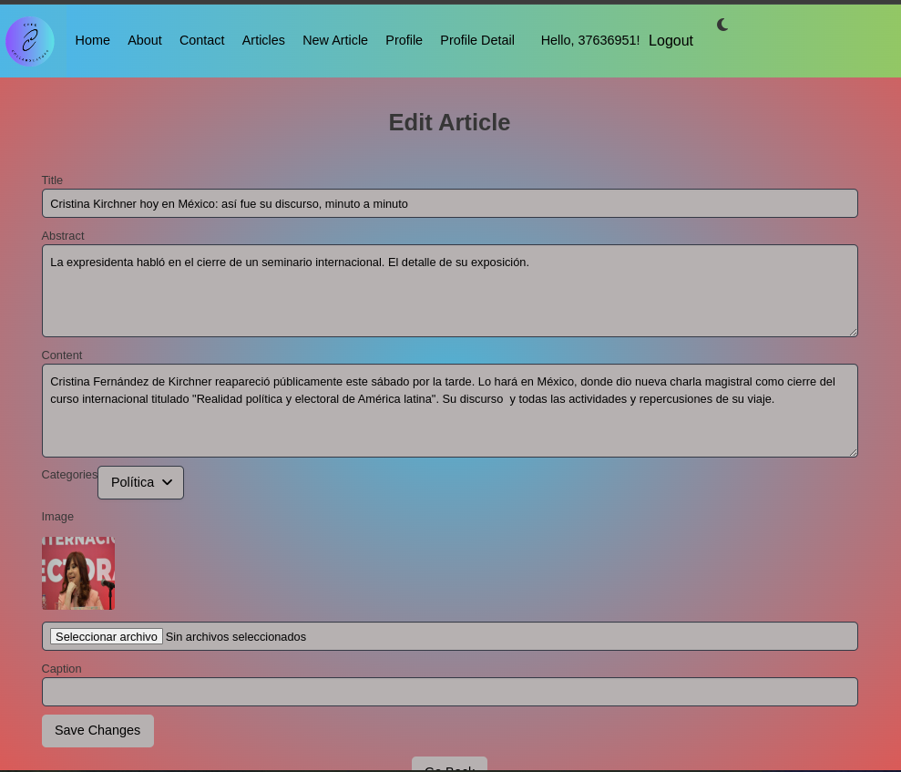

Documentación de Code Collaborators

1. Descripción General del Proyecto
   Nombre del Proyecto
   Code Collaborators

Descripción
Code Collaborators es un portal de noticias diseñado para permitir a los usuarios finales leer, crear, editar y eliminar artículos de noticias. Es una plataforma colaborativa donde los usuarios pueden compartir y gestionar información actualizada.

Audiencia Objetivo
La página está destinada a usuarios finales, que pueden ser tanto lectores de noticias como colaboradores que desean aportar contenido.

Tecnologías Utilizadas
Frontend: React
Backend: Django
Estilos: Bulma
Rutas: React Router Dom
Interacción con la API: Axios 2. Estructura del Proyecto
Arquitectura del Proyecto
El proyecto se divide en dos grandes partes:

Frontend: Implementado en React, gestionado con Vite.
Backend: Implementado en Django, que maneja la lógica de negocio, la autenticación y la interacción con la base de datos.
Base de Datos: Utilizada por Django para almacenar la información de los usuarios y artículos.
Componentes Principales
Home: Página principal donde se muestran los artículos más recientes.
NavBar: Barra de navegación para moverse entre las distintas secciones de la página.
Login: Sistema de autenticación necesario para que los usuarios puedan crear, editar o eliminar artículos. 3. Configuración e Instalación
Requisitos Previos
Antes de comenzar, asegúrate de tener instalados los siguientes componentes:

npm: Administrador de paquetes de Node.js.
Node.js: Entorno de ejecución para JavaScript.
Guía de Instalación:

1- Clona el repositorio del proyecto:

git clone https://github.com/tuusuario/code-collaborators.git

2- Navega al directorio del proyecto:

cd code-collaborators

Instala las dependencias utilizando npm:

npm install

Ejecuta el proyecto localmente:

npm run dev

Configuración
En el archivo package.json, las dependencias principales son:

"dependencies": {
"@fortawesome/fontawesome-free": "^6.6.0",
"axios": "^1.7.3",
"bulma": "^1.0.1",
"dotenv": "^16.4.5",
"react": "^18.3.1",
"react-dom": "^18.3.1",
"react-responsive-carousel": "^3.2.23",
"react-router-dom": "^6.25.1"
}

4. Uso y Funcionalidades

Guía de Uso

Navegación: Los usuarios pueden navegar por la página utilizando la barra de navegación.

Creación de Artículos: Para crear un artículo, el usuario debe estar autenticado. Una vez autenticado, puede acceder al formulario de creación de artículos desde la página principal.

Edición y Eliminación: Los usuarios autenticados pueden editar o eliminar artículos que han creado.

Ejemplos de Uso

Inicio de Sesión:

Vista de Artículos: Ejemplo de cómo se ve un artículo publicado en la página principal.

